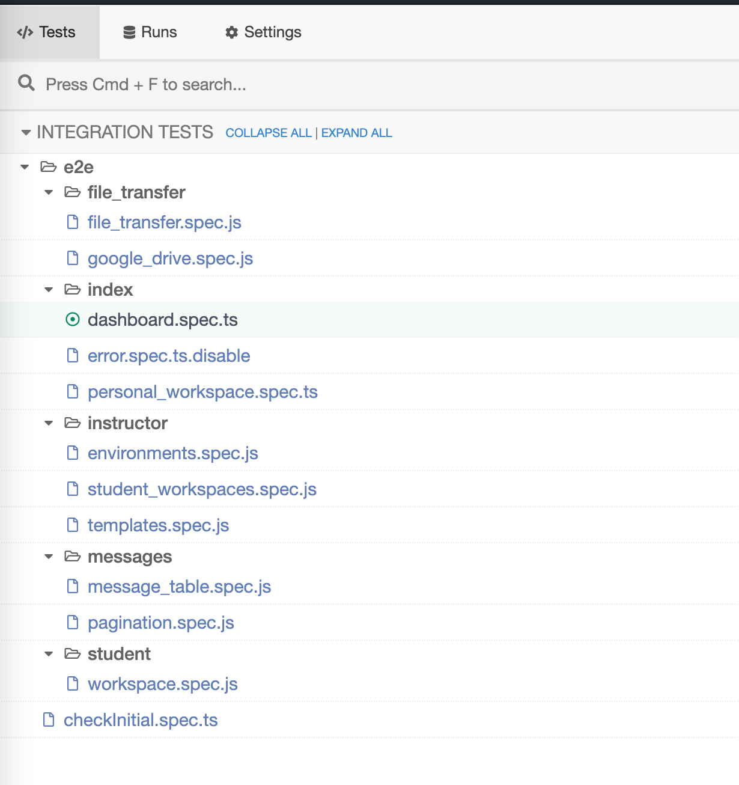

# Cypress e2e testing for Cnails

**The test videos and reports are kept under the `cypress` directory.**

# Cypress

https://user-images.githubusercontent.com/43137033/156647940-25911b41-f8fa-41db-831a-c9c2b31b245c.mp4

Cypress is responsible for the unit testing, integration testing and end-to-end testing. The source code of test is kept under the `cypress` folder with `cypress.json` as the configuration file in the project root.

Runnning all the test at once is time-consuming, most of the time tests are only ran when needed. Using this command `npx cypress run --spec <filepath>`.

Although unit testing's scope is bounded to the frontend, the end to end test has a much larger scope. Any problem that happens in the end to end could be caused by any part of the system (could be frontend or backend or something else). End to end test is most likely to be affected by many side effects, to avoid side effects, you might to "fake" certain components in the system. But I don't have time to do it, so the test progress is prioritized to "frontend-first". Side effects outside the frontend is ignored as much as possible.

## npm script to run test

> Set the environment variables in `cypress.json`. Please use a test account.
> Also check your states by using the `checkInitial.spec.ts`
>
> > 

1. `npm run e2e ; npm run report`: The first part run cypress and generate report in JSON format. The second part generate markdown report from the json files. The report will be generated under `cypress/reports`.

## run test using `cypress open`

1. `npx cypress open`
